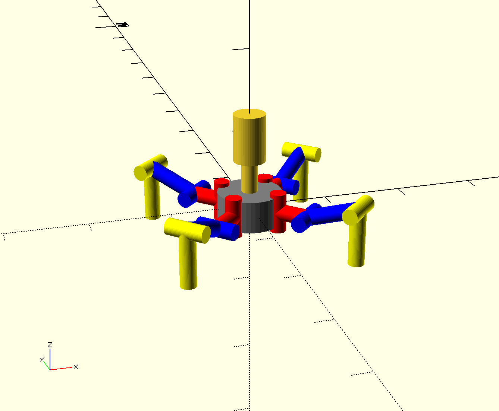
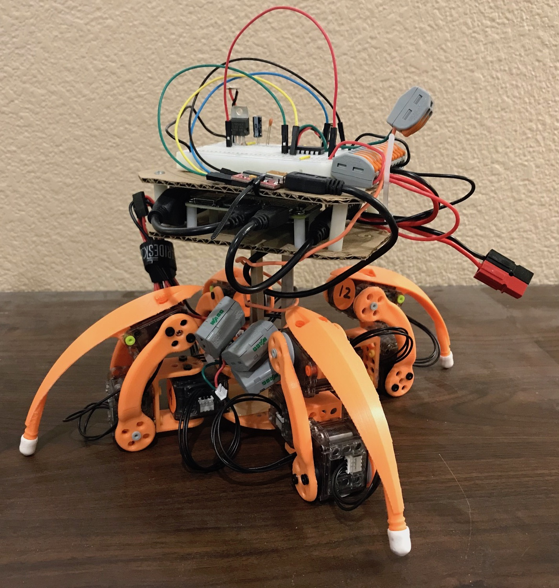

# XL-320 Quadruped

**No works is being done on this robot anymore**

This robot uses XL-320 smart servos from Robotis. It has 3 servos per leg:

- Coxa: red
- Femur: blue
- Tibia: yellow

My robot walking:

-   [YouTube](https://www.youtube.com/watch?v=kH2hlxUfCNg)
-   [Vimeo](https://player.vimeo.com/video/194676675)

# Hardware

- [Mechanical](mechanical/)
- [Electrical](electrical/)

# Software

This robot uses the [multiped](https://github.com/MultipedRobotics/multiped) library. **Note:**
the library has progressed, so there maybe some issues with how this robot accessed the library
years ago!

MIT License
-----------

**Copyright (c) 2016 Kevin J. Walchko**

Permission is hereby granted, free of charge, to any person obtaining a
copy of this software and associated documentation files (the
"Software"), to deal in the Software without restriction, including
without limitation the rights to use, copy, modify, merge, publish,
distribute, sublicense, and/or sell copies of the Software, and to
permit persons to whom the Software is furnished to do so, subject to
the following conditions:

The above copyright notice and this permission notice shall be included
in all copies or substantial portions of the Software.

THE SOFTWARE IS PROVIDED "AS IS", WITHOUT WARRANTY OF ANY KIND,
EXPRESS OR IMPLIED, INCLUDING BUT NOT LIMITED TO THE WARRANTIES OF
MERCHANTABILITY, FITNESS FOR A PARTICULAR PURPOSE AND NONINFRINGEMENT.
IN NO EVENT SHALL THE AUTHORS OR COPYRIGHT HOLDERS BE LIABLE FOR ANY
CLAIM, DAMAGES OR OTHER LIABILITY, WHETHER IN AN ACTION OF CONTRACT,
TORT OR OTHERWISE, ARISING FROM, OUT OF OR IN CONNECTION WITH THE
SOFTWARE OR THE USE OR OTHER DEALINGS IN THE SOFTWARE.
